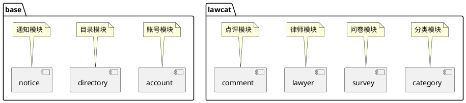

```plantuml
@startuml

package base {

[account]
note top: 账号模块

[directory]
note top: 目录模块

[notice]
note top: 通知模块

}

package lawcat {

[category]
note top: 分类模块

[survey]
note top: 问卷模块

[lawyer]
note top: 律师模块

[comment]
note top: 点评模块

}

@enduml
```