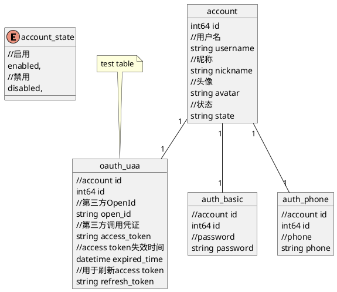
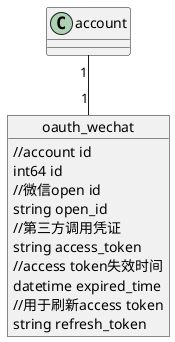
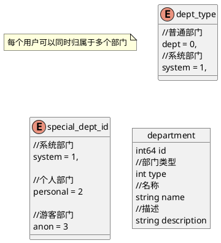
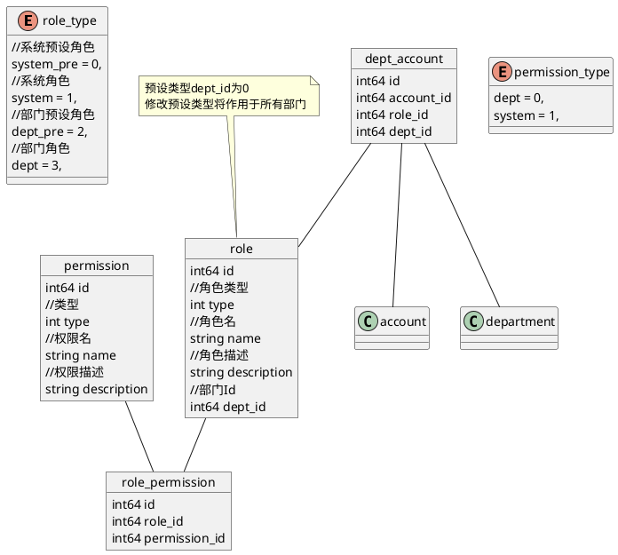

```plantuml
@startuml

enum account_state {
    //启用
    enabled,
    //禁用
    disabled,
}

object account {
    int64 id
    //用户名
    string username
    //昵称
    string nickname
    //头像
    string avatar
    //状态
    string state
}

object oauth_uaa {
    //account id
    int64 id
    //第三方OpenId
    string open_id
    //第三方调用凭证
    string access_token
    //access token失效时间
    datetime expired_time
    //用于刷新access token
    string refresh_token
}
note top: test table
account "1" -- "1" oauth_uaa

object auth_basic {
    //account id
    int64 id
    //password
    string password
}
account "1" -- "1" auth_basic

object auth_phone {
    //account id
    int64 id
    //phone
    string phone
}
account "1" -- "1" auth_phone

@enduml
```

```plantuml
@startuml

object oauth_wechat {
    //account id
    int64 id
    //微信open id
    string open_id
    //第三方调用凭证
    string access_token
    //access token失效时间
    datetime expired_time
    //用于刷新access token
    string refresh_token
}

account "1" -- "1" oauth_wechat

@enduml
```

```plantuml
@startuml


note "每个用户可以同时归属于多个部门" as dept_note

enum dept_type {
    //普通部门
    dept = 0,
    //系统部门
    system = 1,
}

enum special_dept_id {
    //系统部门
    system = 1,

    //个人部门
    personal = 2

    //游客部门
    anon = 3
}

object department {
    int64 id
    //部门类型
    int type
    //名称
    string name
    //描述
    string description
}

@enduml
```

```plantuml
@startuml

enum role_type {
    //系统预设角色
    system_pre = 0,
    //系统角色
    system = 1,
    //部门预设角色
    dept_pre = 2,
    //部门角色
    dept = 3,
}

object role {
    int64 id
    //角色类型
    int type
    //角色名
    string name
    //角色描述
    string description
    //部门Id
    int64 dept_id
}
note top: 预设类型dept_id为0\n修改预设类型将作用于所有部门

enum permission_type {
    dept = 0,
    system = 1,
}

object permission {
    int64 id
    //类型
    int type
    //权限名
    string name
    //权限描述
    string description
}

object role_permission {
    int64 id
    int64 role_id
    int64 permission_id
}

role -- role_permission
permission -- role_permission

object dept_account {
    int64 id
    int64 account_id
    int64 role_id
    int64 dept_id
}

dept_account -- role
dept_account -- account
dept_account -- department

@enduml
```