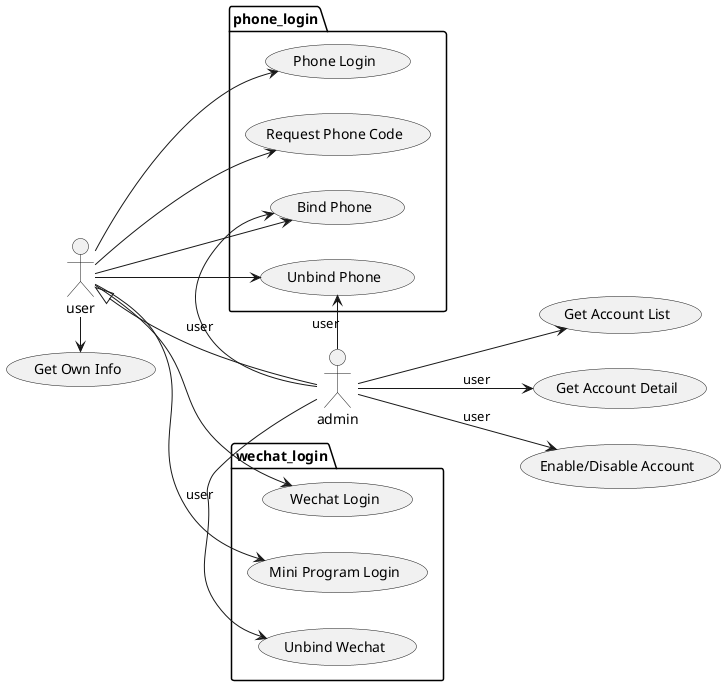

```plantuml
@startuml

left to right direction

:user:
:admin:
user <|-- admin

user -> (Get Own Info)

package phone_login {
    user -> (Phone Login)
    user -> (Request Phone Code)
    user -> (Bind Phone)
    user -> (Unbind Phone)

    admin -> (Bind Phone) : user
    admin -> (Unbind Phone) : user
}

package wechat_login {
    user -> (Wechat Login)
    user -> (Mini Program Login)

    admin -> (Unbind Wechat) : user
}

admin --> (Get Account List)
admin --> (Get Account Detail) : user
admin --> (Enable/Disable Account) : user

@enduml
```