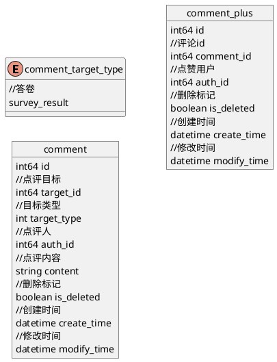

```plantuml
@startuml
left to right direction

enum comment_target_type {
    //答卷
    survey_result
}

object comment {
    int64 id
    //点评目标
    int64 target_id
    //目标类型
    int target_type
    //点评人
    int64 auth_id
    //点评内容
    string content
    //删除标记
    boolean is_deleted
    //创建时间
    datetime create_time
    //修改时间
    datetime modify_time
}

object comment_plus {
    int64 id
    //评论id
    int64 comment_id
    //点赞用户
    int64 auth_id
    //删除标记
    boolean is_deleted
    //创建时间
    datetime create_time
    //修改时间
    datetime modify_time
}

@enduml
```