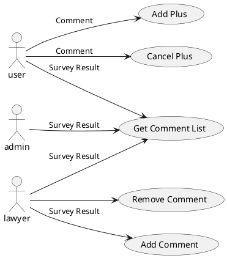

```plantuml
@startuml
left to right direction

user --> (Get Comment List) : Survey Result
user --> (Add Plus) : Comment
user --> (Cancel Plus) : Comment

lawyer --> (Get Comment List) : Survey Result
lawyer --> (Add Comment) : Survey Result
lawyer --> (Remove Comment)

admin --> (Get Comment List) : Survey Result
@enduml
```