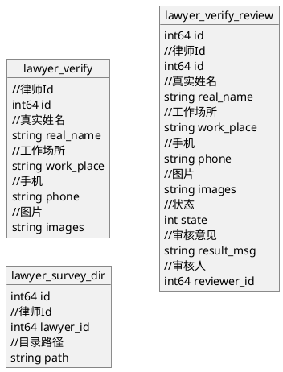

```plantuml
@startuml
left to right direction

object lawyer_verify {
    //律师Id
    int64 id
    //真实姓名
    string real_name
    //工作场所
    string work_place
    //手机
    string phone
    //图片
    string images
}

object lawyer_survey_dir {
    int64 id
    //律师Id
    int64 lawyer_id
    //目录路径
    string path
}

object lawyer_verify_review {
    int64 id
    //律师Id
    int64 id
    //真实姓名
    string real_name
    //工作场所
    string work_place
    //手机
    string phone
    //图片
    string images
    //状态
    int state
    //审核意见
    string result_msg
    //审核人
    int64 reviewer_id
}

@enduml
```