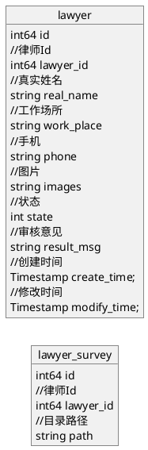

```plantuml
@startuml
left to right direction

object lawyer_survey {
    int64 id
    //律师Id
    int64 lawyer_id
    //目录路径
    string path
}

object lawyer {
    int64 id
    //律师Id
    int64 lawyer_id
    //真实姓名
    string real_name
    //工作场所
    string work_place
    //手机
    string phone
    //图片
    string images
    //状态
    int state
    //审核意见
    string result_msg
    //创建时间
    Timestamp create_time;
    //修改时间
    Timestamp modify_time;
}

@enduml
```