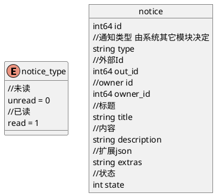

```plantuml
@startuml

enum notice_type {
    //未读
    unread = 0
    //已读
    read = 1
}

object notice {
    int64 id
    //通知类型 由系统其它模块决定
    string type
    //外部Id
    int64 out_id
    //owner id
    int64 owner_id
    //标题
    string title
    //内容
    string description
    //扩展json
    string extras
    //状态
    int state
}
@enduml
```