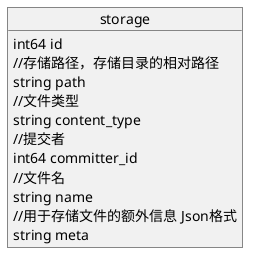

```plantuml
@startuml

object storage {
    int64 id
    //存储路径，存储目录的相对路径
    string path
    //文件类型
    string content_type
    //提交者
    int64 committer_id
    //文件名
    string name
    //用于存储文件的额外信息 Json格式
    string meta
}

@enduml
```