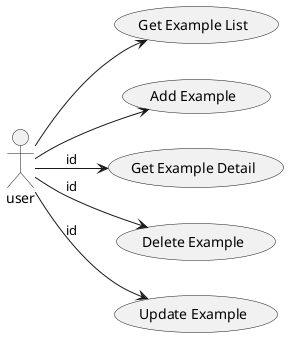

```plantuml
@startuml
left to right direction

user --> (Get Example List)
user --> (Add Example)
user --> (Get Example Detail) : id
user --> (Delete Example) : id
user --> (Update Example) : id

@enduml
```