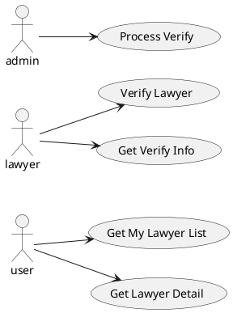

```plantuml
@startuml
left to right direction

user --> (Get My Lawyer List)
user --> (Get Lawyer Detail)

lawyer --> (Verify Lawyer)
lawyer --> (Get Verify Info)
admin --> (Process Verify)

@enduml
```