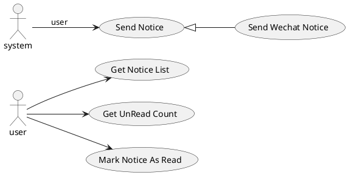

```plantuml
@startuml
left to right direction

user --> (Get Notice List)
user --> (Get UnRead Count)
user --> (Mark Notice As Read)

system --> (Send Notice) : user

(Send Notice) <|-- (Send Wechat Notice)

@enduml
```