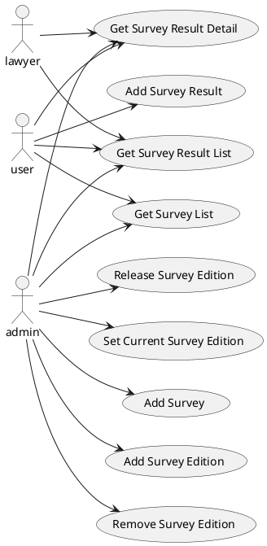

```plantuml
@startuml
left to right direction

user --> (Get Survey List)
user --> (Add Survey Result)
user --> (Get Survey Result List)
user --> (Get Survey Result Detail)

lawyer --> (Get Survey Result List)
lawyer --> (Get Survey Result Detail)

admin --> (Add Survey)
admin --> (Add Survey Edition)
admin --> (Remove Survey Edition)
admin --> (Release Survey Edition)
admin --> (Set Current Survey Edition)

admin --> (Get Survey List)
admin --> (Get Survey Result List)
admin --> (Get Survey Result Detail)

@enduml
```